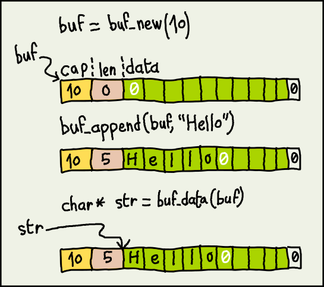

# Buf
Experimental string buffer library.  

## Why ?

Because C strings are painful, unsafe and slow.    

Say you're making a forum engine,  
where a *page* is a fixed-size buffer that you fill with posts.  

How would you safely build a page without truncating posts ?

### The hard way

```C
char page[PAGE_SZ];

// Keep track !
size_t page_len = 0;

while(1) {

    char* user = db_col("user");
    char* text = db_col("text");

    // Big enough ?
    #define POST_SZ 100

    // Better malloc and realloc ?
    char post[POST_SZ];  

    // May be truncated !
    snprintf (post, POST_SZ, "<div>%s<p>%s</p></div>", user, text);

    // Typing "strlen()" 100 times a day..
    const size_t post_len = strlen(post);

    // Check if it fits !
    // What about terminating null ? Will it fit ?
    if (page_len + post_len < PAGE_SZ) {    
        // Not sure..
        strncat (page, post, PAGE_SZ-page_len); 
        // ..about all this.
        page_len += post_len;
    } else {
        break;
    } 
}
```

### The Buf way

```C
Buf page = buf_new(PAGE_SZ);

while(1) {

    char* user = db_col("user");
    char* text = db_col("text");

    if (!buf_append (page, "<div>%s<p>%s</p></div>", user, text)) {
        break;
    }
}
```

## Principle

The *Buf* type is an opaque pointer to a struct.  
This struct ends with a flexible array :  

```C
struct Buf_s *Buf;

struct Buf_s {
    uint32_t cap;  // capacity
    uint32_t len;  // current length
    unsigned char data[];  // null-terminated string
}
```

Making *\*Buf* a contiguous chunk of memory.  
And you still get your good old C-string through the *buf_data()* accessor.



## Quick sample

The *example* folder implements the 'forum'.  
It reads rows from a mock db, and renders them to a page of limited size.  
When the next post won't fit, we flush the page and start anew.  

`make && cd example && ./forum`

# API

### buf_new
`Buf buf_new (const size_t cap);`  

Allocate a fresh *Buf* of capacity *cap*.  
To release, simply `free(buf);`

### buf_append
`int buf_append (Buf buf, const char* fmt, ...);`  

Append a formatted c-string to *buf*.  
If new data would exceed capacity, *buf* stays unmodified.  
Returns: change in length, or zero on failure. 

### buf_write
`int buf_write (Buf buf, const char* fmt, ...);`  

Write a formatted c-string at start of *buf*.  
If new data would exceed capacity, *buf* stays unmodified.  
Returns: new length, or zero on failure.

### buf_dup
`Buf buf_dup (const Buf buf);`  

Make a clone.

### buf_resize
`bool buf_resize (Buf* pbuf, const size_t newcap);`  

Change capacity.  
If lowered below length, data will be truncated.  


### buf_reset
`void buf_reset (Buf buf);`  

Set data length to zero.  

### Accessors
 
Capacity  
`size_t buf_cap (const Buf buf);` 

Current length  
`size_t buf_len (const Buf buf);` 

Data string  
`const char* buf_data (const Buf buf);`

## Usage

<pre>
// app.c

#include &lt;stdio.h&gt;
#include "buf.h"

int main() {

    char name[] = "Bob";
    Buf msg = buf_new(100);

    buf_append (msg, "Hello! ");
    buf_append (msg, "My name is %s", name);

    puts (buf_data(msg));

    //-> Hello! My name is Bob

    return 0;
}
</pre>

`gcc app.c buf.o -o app`

## Build & unit-test

`make && make check`

## TODO
* utf8 ?
* Add methods like split() ?
* Make separate FlexBuf lib with auto-resize ?